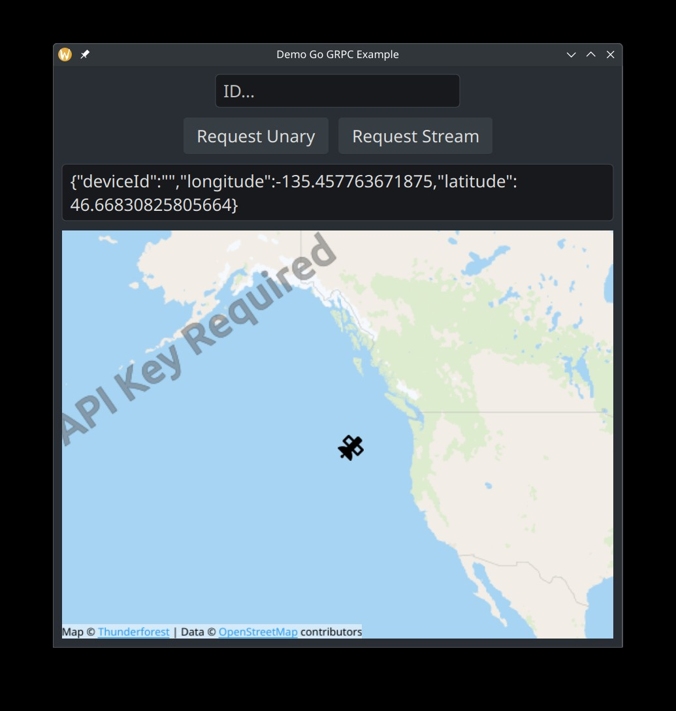

# GoQtgRPC

An exploratory work to embed a Go gRPC server inside a C++ app using QML to interact with the gRPC API.



See [associated blogpost: Building Cross-Language Apps: Direct QML to gRPC Without C++](https://blog.nobugware.com/post/2025/using-qt-qml-grpc-to-talk-to-your-app/)

## Build

```sh
buf generate
cd cposlib && CGO_ENABLED=1 go build -buildmode=c-archive -o cposlib.a ./cposlib.go
cmake -B build .
make
```

## Pitfalls
- id conficting with qml id
- the GrpcHttp2Channel hostUri can't be changed
- timestamp.proto imports
